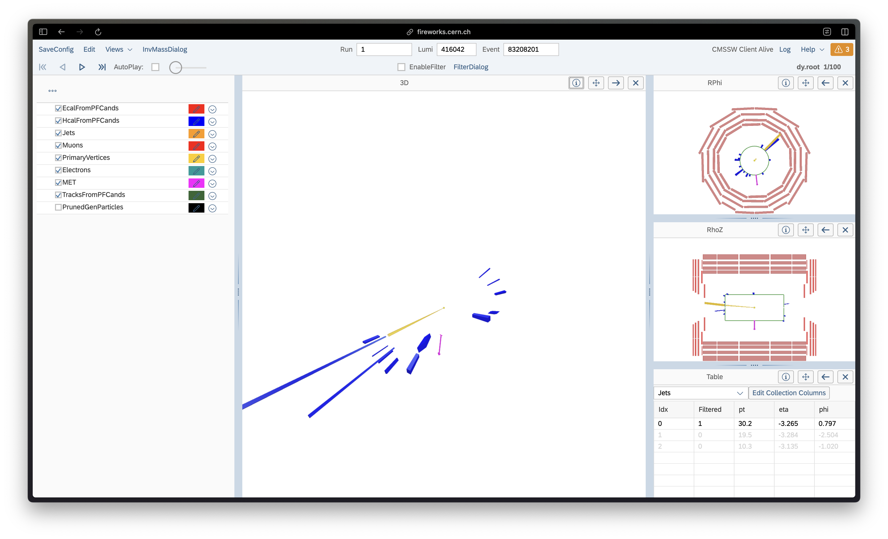
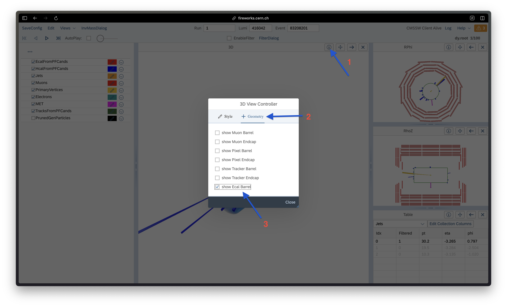
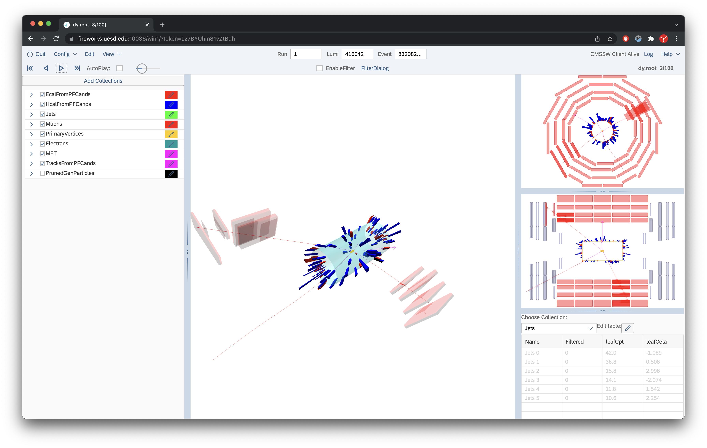
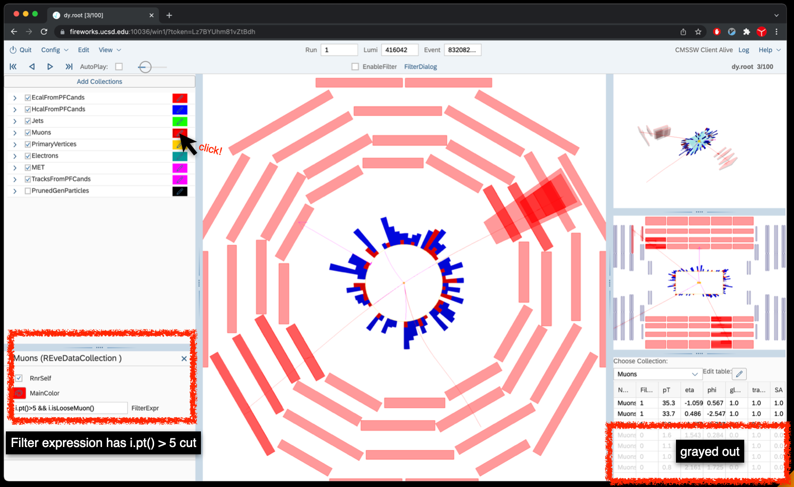
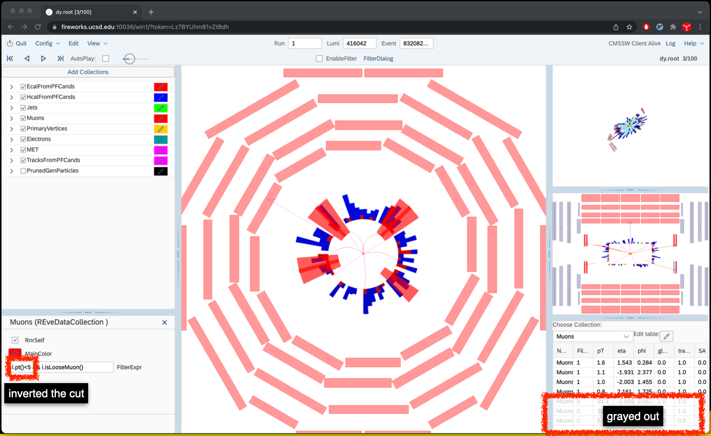
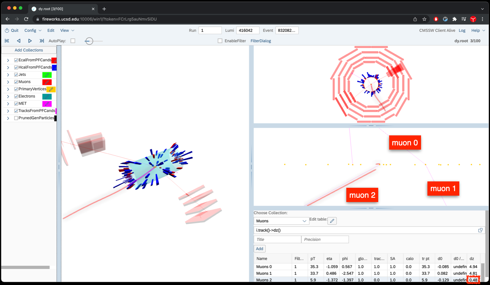
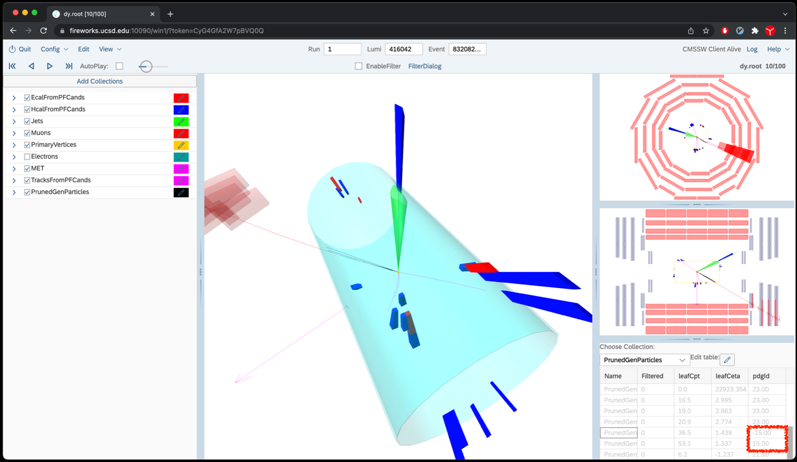
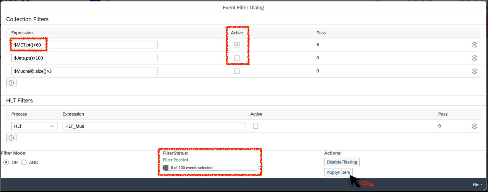

Open
[http://fireworks.cern.ch](http://fireworks.cern.ch/){: target="_blank"} and take a look at `/store/group/upgrade/visualization/dy.root`.

Once the path is provided click the
`Load File EOS` button. Once it opens you should something like the following:

{: width="70%"}

To get a better sense of the event's geometry, you can add the ECAL barrel to the event view in the following way:

{: width="70%"}

Before starting to play around, we can move to a more interesting event. You can scan through the events by clicking the event navigation buttons (right arrow), or enter the Run/Lumi/Event number directly. In this exercise, each file has only one Run, you just need to edit the lumi/event number to go to the new event.

Skip to the third event in the file, run/lumi/event is
1/416042/83208204.

{: width="70%"}

Try to click the interesting objects in the 3D view window and answer the below question:

> ## Question 1
>  How many different kinds of objects are there? What are they?
{: .challenge }
Try to explore this event with different views with Fireworks. To swap the \"main\" panel with other view, click the button with the left-pointing arrow in the panel you wish to make your main one. You can look at other available views by clicking `Views` in the top-left and then the selecting the view you wish to add from the drop-down menu.


> ## Question 2
> Using the Table View on the bottom right, from the drop down menu below `Choose Collection:` choose Muons.
> How many additional Muons are not being displayed? (i.e. grayed out) Why
> are they hidden (Hint: press the \"pencil-shaped\" button in the left
> panel \"Muons\" section)?
>
>> ## Solution
>> In this configuration, the muon collection is filtered with expression "pt()>5 & isLooseMuon()",
>> meaning that each muon is only displayed if its pT is larger than 5 !GeV, and it passes the Loose ID requirements.
>> {: width="70%"}
> {: .solution}
{: .challenge}


> ## Question 3
> Change the filter expression to
> display only muons with pT lower than 5 GeV (revert the change afterwards)
>> ## Solution
>> You should see this:
>> {: width="70%"}
>{: .solution}
{: .challenge}

> ## Question 4
> Use the Table View in the bottom right corner to learn more details about the Muons collection. The table
> doesn\'t show dZ, to add it: in the table panel, go to the Muons collection, and click on the \"Edit Collection Columns\" button; then in the expression text box,
> write `i.track()->dz()`, give a title \"dz\", and define precision \"3\"
> and click \"Add\". Why does the 5.9 GeV muon stand out? Could you have seen this by zooming in on the Rho-Z View?
>> ## Solution
>> You should see this:
>> {: width="70%"}
> {: .solution}
{: .challenge}

> ## Question 5
> Go to the 9th event in the file, run/lumi/event is 1/416042/83208226. What kind of event is it?
>
>> ## Solution
>>Z->ee event
> {: .solution}
{: .challenge}

> ## Question 6
> Uncheck the \"Electrons\" box to
>prevent them from being displayed: are there track pointing to both ECAL deposits?
>> ## Solution
>> Yes.
> {: .solution}
{: .challenge}

> ## Question 7
>  Go to the next event, the 10th event in the file, run/lumi/event is 1/416042/83208227. What kind of
> event is it? What is the MET in this event? What is the transverse mass (mT) of the muon+MET+jet? What about for the muon+MET+LeadingTrack? This
> is MC, so you can peak at the GenParticles to check your hypothesis. You will have to add pdgId to the column to get a better understanding of the event. From the Table view once the
> `PrunedGenParticles` is selected, edit the table to add \"i.pdgId()\" expression with \"pdgId\" title with precision of 0.
>
> NOTE: The legacy fireworks had kinematic variable calculator provided with the app. The feature is being worked on and will be added in the
> near future.
>> ## Show Answer
>> ```
>> MET is et = 46.6 !GeV, phi = -0.414
>> Muon has pt = 11.0 !GeV, eta = 1.292, phi = -0.580
>> Jet has pt = 39.6 !GeV, eta = 1.453, phi = 2.865
>> Track has pt = 32.6 !GeV,eta = 1.456, phi = 2.869
>>
>> mT(met, muon, jet) = 95.2 !GeV
>> mT(met, muon, track) = 86.4 !GeV
>>```
>> The event is likely a Z->tautau, with one tau decaying leptonically (muon + MET) and another in a one-prong hadronic tau decay. The one prong tau track is clustered in a jet with pT = 39.6 !GeV. When looking at the PrunedGenParticles list, one will find that there are pdgId 15 and -15 particle (grayed out) listed confirming that the event is indeed Z->tautau. The track pT is closest to the origina pion (pdgId=211) pT of 31.8 !GeV and also the eta.
>> {: width="70%"}
> {: .solution}
{: .challenge}


Now let us use event filter by clicking the event filter button called
`FilterDialog`. Search for events with large MET (i.e. \>60
GeV). Select only the MET filter to be `Active`. Then click `ApplyFilters` button.
Once the filter runs the `FilterStatus:` will report the number of events passing.
>##  Question 8
>  How many events are selected? Can you guess what is the cause?
>> ## Show Answer
>>
>>In total, six events are selected.
>>All are `Z-->TauTau` events except events 83208351, 8365, 8506.
>>Event 83208351 is a Z(ee)+jets event, the electrons are reconstructed properly (the invariant mass matches the Z). There is a below-threshold jet (pT=24.2 GeV) in the direction opposite to the MET, which could be mis-measured or coming from pile-up.
>>
>>Event 83208365 is a Z(mm)+jets event with one muon out of acceptance (pt = 45 GeV, eta = 2.4). The lost muon explains most of the MET, while the rest can be ascribed to jet mis-measurement.
>>
>>Event 83208506 is a Z(mm)+jets event with both muons out of acceptance and two very forward jets. Lost muons and mis-measured jets lead to the MET.
>>
>> {: width="70%"}
> {: .solution}
{: .challenge}
