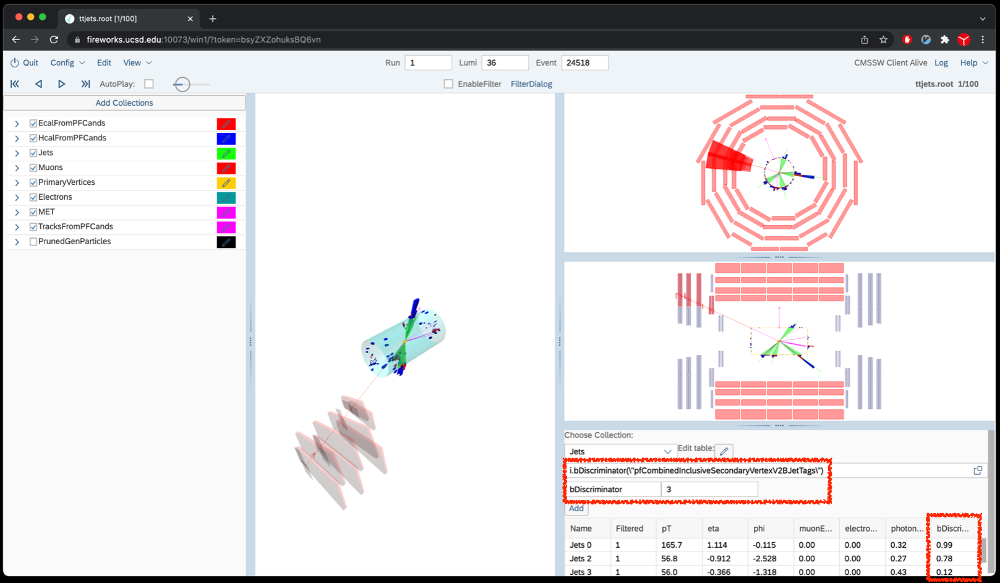
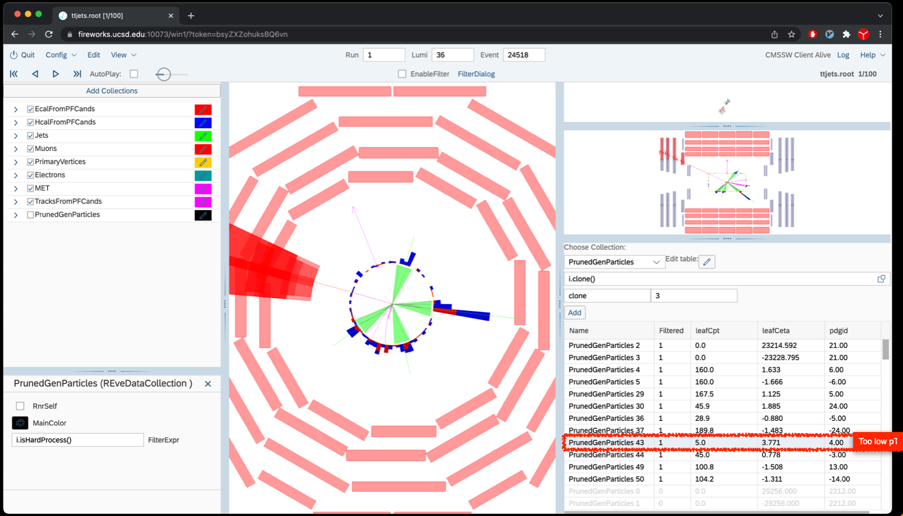
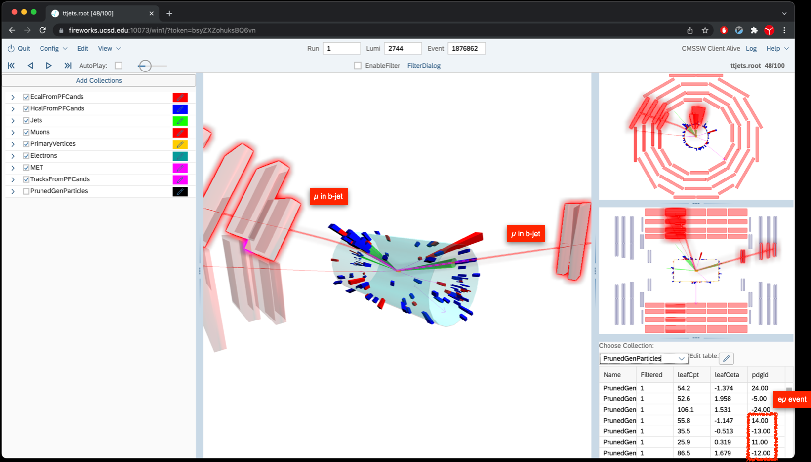

The LHC has a very large ttbar production cross section, it is often
called a top factory. Understanding ttbar events would be an important
task for standard model measurement or searches for new physics. Now let
us scan the ttbar file `/store/group/upgrade/visualization/ttjets.root`

Since events start to become complicated, a few hints before we start:

Hint 1: Top quarks decay into W+b, so you can look for b-tagged jets. To
do this, create a table for the jet collection and add the b-tag
discriminator method,
`i.bDiscriminator(\"pfCombinedInclusiveSecondaryVertexV2BJetTags\")`. A
\"medium\" b-tagging working point requires that the discriminator value
is larger than 0.8. Alternatively, add a new Jet collection (\"Add
Collection\") with a bDiscriminator filter applied.

 **NOTE: Please do not forget the escape character \"\\\"**.

> ## Show/Hide
> {: width="70%"}
{: .solution}

**Hint 2 (MC only)**: use the PrunedGenParticles collection to make sense of the event: filter the collection with \"!isHardProcess\" to get the relevant particles (rather than the default filter).

First, go to the first event, 36/24518.

> ## Question 9
>  What is this event? Can you find the combination of jets from Ws and from tops?
> > ## Show/Hide
> >This is a particularly difficult ttbar event, with one W decaying to leptons (muon+neutrino), and other to hadrons.
>>
>> The transverse mass (mT) of the muon+MET is 98 GeV, very high for a W, presumably due to MET resolution.
>> To make things worse, one of the quarks from the hadronic W is very low pT and does not form a jet.
>> {: width="70%"}
> {: .solution}
{: .challenge}


Next, let\'s see event 2744/1876862
> ## Question 10
>  What are the objects in the event? Are the muons close to jets?
> > ## Show Answer
> > This is a nice dilepton (e+mu) ttbar event. There are three muons, but two of them are close to jets. Looking at the
>>truth record, we confirm that those two jets are coming from the b quarks. The truth record says that there are following two b-quarks:
>>
>>```
>>pt = 87.4 !GeV, eta = -0.49, phi = 2.39,
>>pt = 52.6 !GeV, eta = 1.96, phi = 1.71
>>
>>While the two jets are
>>pt = 66.5 !GeV, eta = -0.721, phi = 2.287
>>pt = 38.4 !GeV, eta = 2.012, phi = 1.622
>>```
>>The eta / phi directions show good agreement indicating that these indeed are the b-jets.
>> {: width="70%"}
>{: .solution}
{: .challenge}
