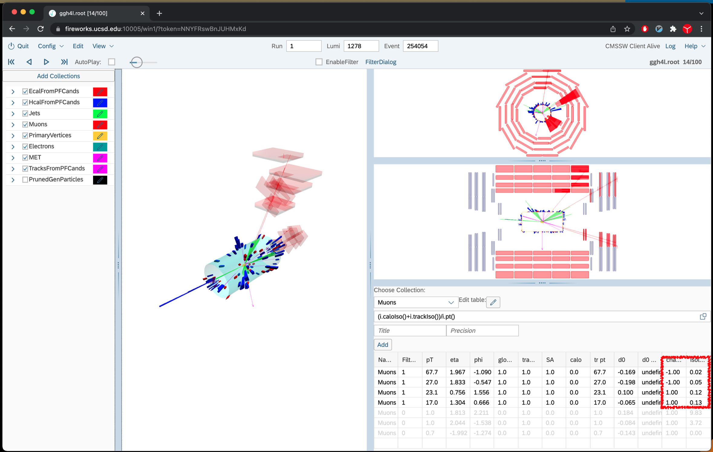

## Exploration 3: Higgs Physics

Now let us scan the Higgs file
`/store/group/upgrade/visualization/ggh4l.root`

First go to event 1278/254045.

> ## Question 11
>  How many leptons in this event? What is this event? Can you calculate the invariant mass of the higgs? Are both Zs on-shell and
> if not which is the off-shell one?
> > ## Show/Hide
> > This event is `H->ZZ->2e2mu`. Invariant mass of the Higgs is 125.9 GeV, the off-shell Z is the one from the muon pair with mass 27.6 GeV (electrons make >> an invariant mass of 92.4 GeV)
> {: .solution}
{: .challenge}

------------------------------------------------------------

Go to event 1278/254054.

Use the muon table view to get the right charges. (i.e. add a column
with `i.track()->charge()` or `i.charge()`) Let\'s add isolation column.
The more proper PF-based isolation is currently not accessible. So we
will use what is available. Add a column with
`(i.caloIso()+i.trackIso())/i.pt()`. Once you do that you\'ll see
something like this:

Result of adding charge and isolation
{: width="70%"}

Also for isolation
`(i.userIsolation(\"PfChargedHadronIso\")+i.userIsolation(\"PfNeutralHadronIso\")+i.userIsolation(\"PfGammaIso\"))/i.pt()`
can be used as well.
> ## Question 12
>  What is this event? Can you pair the muons and get the invariant mass of the two Zs? Are all 4 muons isolated (Isolation\<0.2)?
> > ## Show/Hide
> > It is `H->ZZ->4mu`. Invariant mass of the Higgs is 126.9 GeV. From the table you can see the charge of the muons and try the combinations with
> > opposite charges. Turns out that muons 0 and 2 are from an on-shell Z with mass 92.1 GeV, muons 1 and 4 from an off-shell Z with mass 27.0 GeV. All of the muons are isolated.
> {: .solution}
{: .challenge}
-----------------------------------------------------

Go to event 1278/254110.
> ## Question 14
>  What is this event? Are the electrons isolated? Can you pair electrons in the correct way? Why is
> the 4th electron not drawn?
>
> Hint: Isolation can be accessed via
> `(i.userIsolation(\"PfChargedHadronIso\")+i.userIsolation(\"PfNeutralHadronIso\")+i.userIsolation(\"PfGammaIso\"))/i.pt()`
>
>> ## Show Answer
>> It is H->ZZ->4e. Invariant mass of the Higgs is 121 GeV. All electrons are fairly isolated, i.e. below 20%, except 1. From the electron table you can see the
>> charge of the electrons and try the combinations with opposite charges. Based on the truth information the first and third electrons are the correct pair, and the 2nd and 4th, each with 23.5 !GeV and 61.9 !GeV respectively.
> {: .solution}
{: .challenge}
