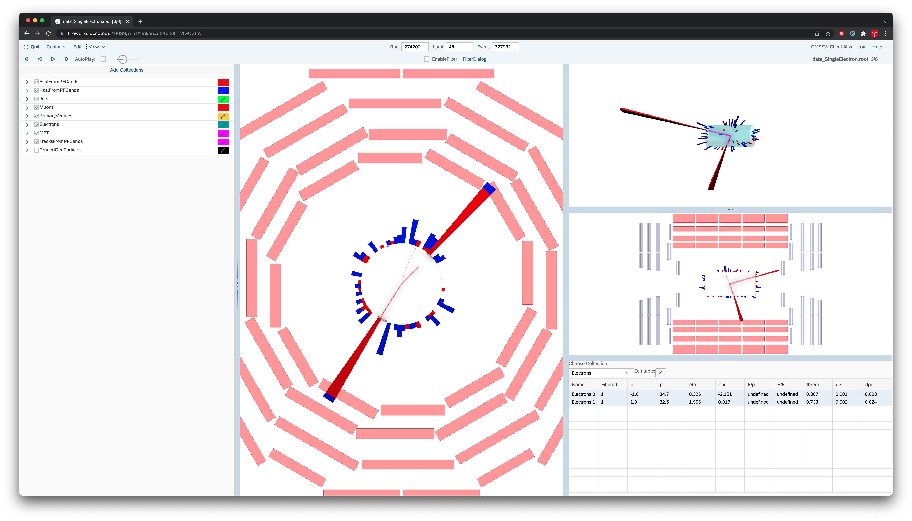
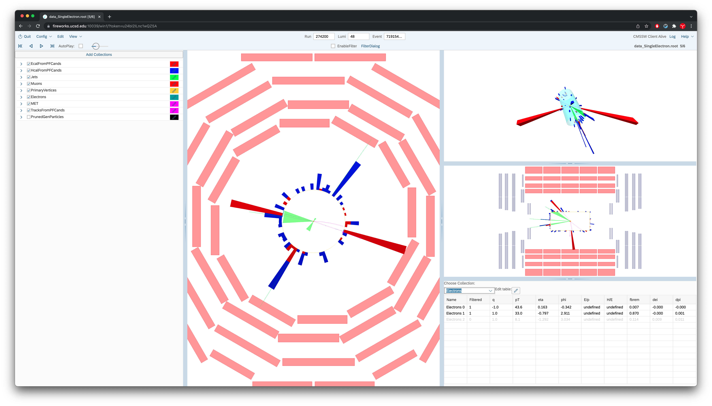
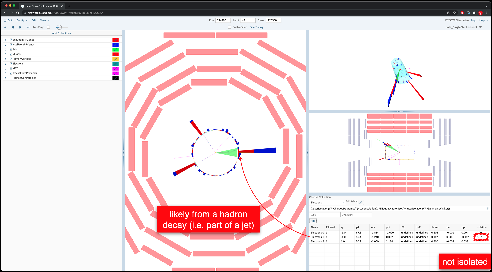

In this section, we will look at collision events at 13TeV. These events
are selected from SingleElectron and SingleMuon datasets. The events
with two or more leptons are selected.

There are a few relevant files. Open the single electron data file,
`/eos/uscms/store/user/cmsdas/2020/short_exercises/Visualization/data_SingleElectron.root`

Go to event 274200:48:72793234
> ## Question 15
> What kind of event is this? How can you justify your answer?
>
>> ## Show/Hide
>> This is a probably a Z->ee event, as can be understood from the invariant mass of the two electrons (90.647 GeV).
>> {: width="70%"}
>{: .solution}
{: .challenge}

---

Go to event 274200:48:71915470
> ## Question 16
>  What kind of event is this? How can you justify your answer?
>> ## Show Answer
>> The invariant mass of the two electrons (84.667 GeV) and that of the two jets (104.962 GeV).
>> This could even be a ZZ->2e2q event, although this process is extremely rare with respect to the more frequent Z+2jets.
>> {: width="70%"}
> {: .solution}
{: .challenge}
---------------

Go to event 274200:48:72636084
> ## Question 17
>  What kind of event is this? How can you justify your answer?
>> ## Show Answer
>> This is probably a Z+jet event, as can be understood from the invariant mass of the two isolated electrons (90.312 GeV).
>>
>> Hint: Isolation can be accessed via `(i.userIsolation(\"PfChargedHadronIso\")+i.userIsolation(\"PfNeutralHadronIso\")+i.userIsolation(\"PfGammaIso\"))/i.pt()`
>> The 2nd electron with very high isolation value is likely part of a quark or gluon (i.e. ISR).
>> {: width="70%"}
> {: .solution}
{: .challenge}

Often we find events that are not trivial to interpret, and usually
there are at least a couple of processes which could have generated the
event. If you got this far in the exercise you have enough experience to
look at some more difficult events and try to guess what they come from.
Typical questions to address are: how many AK4 jets are there in this
event? Are they all isolated from leptons? Are they b-jets? Are there
any electrons in the event with pt\>30GeV? If so, check their isolation.
Are there any muons in the event with pt\>30GeV? If so, check their
isolation. Is this a single lepton event? If so, what is the lepton? Can
you identify any likely top candidates?
> ## Question 18/19
> Look at some interesting events in this dataset and try to interpret them: 1023/1523919869, 1023/1523757530.
{: .challenge}

You can also explore the single muon data file
`/eos/uscms/store/user/cmsdas/2020/short_exercises/Visualization/data_SingleMuon.root`

You can go through the events and characterize each based on the objects you find.

If you have time at the end (after the next section), explore the events stored in

`/eos/uscms/store/user/cmsdas/2020/short_exercises/Visualization/SinglePhoton*.root`, and see if you can find anything interesting.
