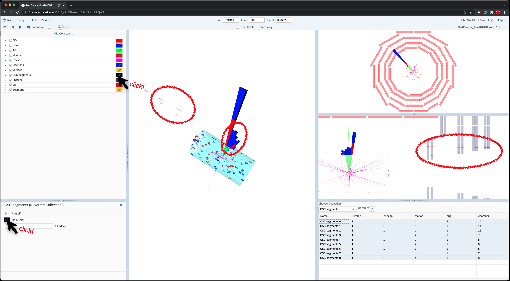
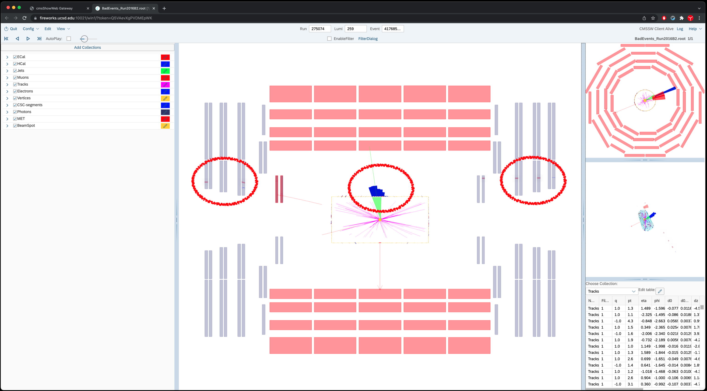
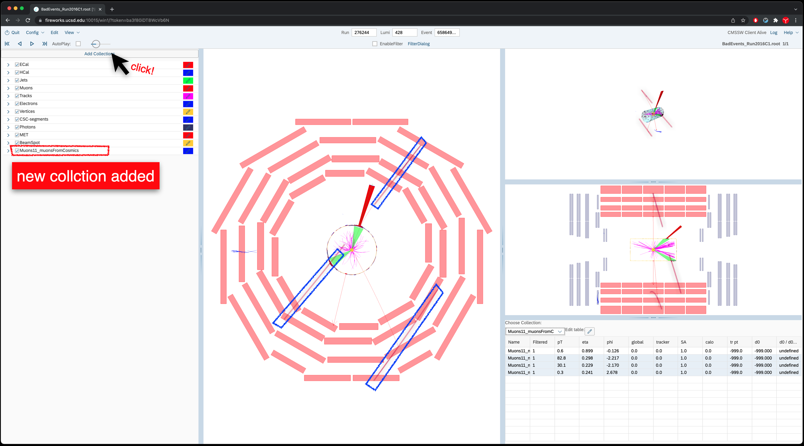
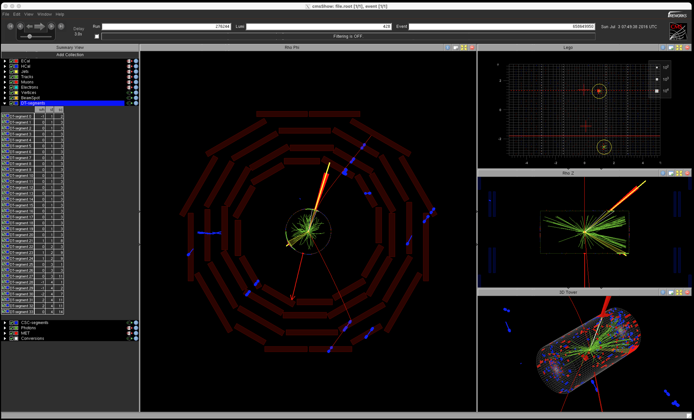
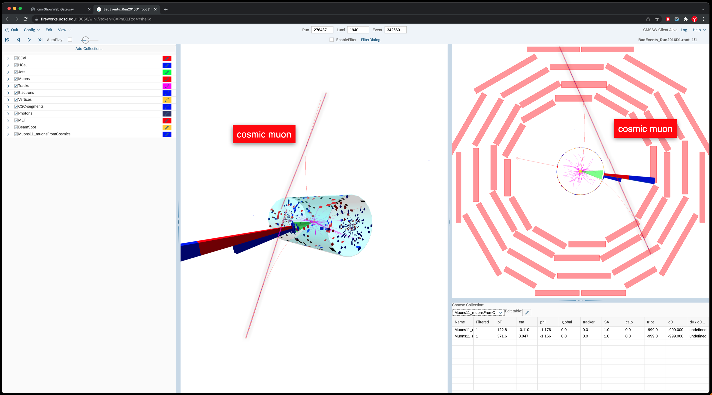

In this section, we will have a look at a few events one does not want
to end up with after having applied an analysis selection. These events
can be of different natures:

-   Cosmics: muons created in the interaction process of cosmic
    radiation with the earth atmosphere can reach the CMS detector and
    leave a signal in the muon systems and even in the calorimeters.
    Those events can be identified due to their peculiar signature: a
    series of hits in the muon chambers (mostly DTs and RPCs) forming a
    straight line. This line can also be aligned with an energy deposit
    in the calorimeters.
-   Beam halo: the protons of the LHC beams can scatter off elements
    inside the pipe. These interactions can create muons travelling
    alongside the beam that can leave signals in the detector. Again,
    those events have quite a striking signature: a series of CSCs hits
    aligned in phi (i.e. aligned with the beam axis) and one or several
    calorimeter towers located at the same azimuthal angle.
-   Reconstruction issues: unlike the two previous sources of undesired
    events, this is not an instrumental issue but a software matter. It
    can happen that the particle flow algorithm (responsible for the
    global reconstruction process) assigns huge momentum to particles,
    due to a mismatch between the tracks and the calorimeter deposits or
    muon chambers hits. The error can also be very large but the
    algorithm keeps it in the reconstruction loop somehow. Those events
    lead to fake very high energy particles and therefore high missing
    transverse energy.

Let\'s now have a look at some of those events:

Go to event 274316:385:698231955 of
`/store/group/upgrade/visualization/BadEvents_Run2016B1.root`

> ## Question 22
> What is this event?
>
> **Hint**
>
> Take a look at the CSC-segments. Due to white background, the CSC view is a bit hard to catch. Change the color to see it a little better.
> If one hovers the mouse one can see click on them to highlight to make it more visible. Also, Ctrl- click will allow user to click multiple at a time.
>> ## Show/Hide
>>  Beam halo – On the Rho-Z view, you observe a series of CSC hits forming a straight line. You can also notice that the HCAL deposit actually consists of several HCAL towers. If you now go to the 3D view, you can see that the HCAL
>> towers lie on the same phi coordinate as the CSC hits. To get even more convinced of the phi correspondence of the calorimeter hits, you can also use the Lego view and zoom on to the area of interest.
>> {: width="70%"}
> {: .solution}
{: .challenge}
---

Go to event 275074:259:417685155 of
`/store/group/upgrade/visualization/BadEvents_Run2016B2.root`

> ## Question 23
>  What is this event?
>> ## Show Answer
>> Beam halo -- This is again a beam halo event. In this case, you actually have CSC hits on both sides of the detector (forward and backward).
>> {: width="70%"}
> {: .solution}
{: .challenge}

------------------------------------------------------------------------

Go to event 276244:428:658649950 of
`/store/group/upgrade/visualization/BadEvents_Run2016C1.root`
> ## Question 24
>  What is this event?
> Hint: The DT-Segments are not available in FireworksWeb for now. (Will be supported in the future.) So this one will be more easier with Legacy
> Fireworks. However, try adding collections (Click Add Collections -\> Search \"cosmic\" -\> Select \"Muons\", \"muonsFromCosmics\" -\>
> AddCollection
>> ## Show/Hide
>> Cosmics --  Looking at the Rho-Phi view, you see that some of the DT hits are forming a straight line. This can also be seen from the Rho-Z view. Going
>>to the 3D view and playing a bit with the point of view, you can observe that the DT line coincides with the ECAL deposits. This is a muon hitting ECAL
>> electronics to create a fake high energy ECAL deposit with no track: a photon
>> (as can be seen from the photon collection).
>>
>>!FireworksWeb with cosmic muon collection:
>>
>> {: width="70%"}
>>Legacy Fireworks screenshot:
>> {: width="70%"}
> {: .solution}
{: .challenge}
-----------------------

Go to event 276437:1940:3426602195 of
`/store/group/upgrade/visualization/BadEvents_Run2016D1.root`
> ## Question 25
>  What is this event?
>> ## Show/Hide
>> Cosmics -- The justification is the same as for the previous event. The straight
>> DT line is quite obvious here. Notice that Fireworks tries to draw tracks
>> coming from the center: it always assumes particles come from the center of the detector.
>> {: width="70%"}
>{: .solution}
{: .challenge}
-----------

Go to event 276544:83:153985051 of
`/store/group/upgrade/visualization/BadEvents_Run2016D2.root`
> ## Question 26
>  What is this event?
>> ## Show/Hide
>> Beam halo -- Another halo event.
>{: .solution}
{: .challenge}
------

Go to event 276585:73:117748568 of
`/store/group/upgrade/visualization/BadEvents_Run2016D3.root`
> ## Question 27
>  What is this event?
>> ## Show/Hide
>> Cosmics -- Another cosmics event.
>{: .solution}
{: .challenge}
----

Go to event 276811:2460:3888980376 of
`/store/group/upgrade/visualization/BadEvents_Run2016D4.root`
> ## Question 28
>  What is this event?
>> ## Show/Hide
>> Cosmics -- Another cosmics event.
>{: .solution}
{: .challenge}
----------

Go to event 276582:638:1144780530 of
`/store/group/upgrade/visualization/BadEvents_Run2016D5_AOD.root`

The fwc file defines all the parameter of the Fireworks display: the
colors, the tables and views, the collections shown, etc. You can always
change the parameters while looking at an event and then save your
configuration in "File→Save Configuration".
> ## Question 29
>  Let\'s now have a look at this event. Can you spot any peculiar feature? \
> *Hint* : Look at the "Muons" table.
>> ## Show/Hide
>> What balances the large MET of 1.9 TeV is the Jets 0, which is made by a single charged hadron track. (i.e. single
>> track line + single hcal/ecal tower).\
>> On the other hand, you notice that a muon (Muon_0) passes right at the same place.\
>> This muon has an insanely large track pT error (much larger than the track pT itself which is already at 2 TeV),\
>> and is not identified by the particle flow algorithm as a muon.\
>> Instead, its inner track is associated with the fake charged hadron we just described above.\
>> This makes up a fake event where a charged hadron balances large MET.\
>>Those are reconstruction issues that happen from time to time and that must be filtered out in order to keep the tail of the MET spectrum clean.
> {: .solution}
{: .challenge}
